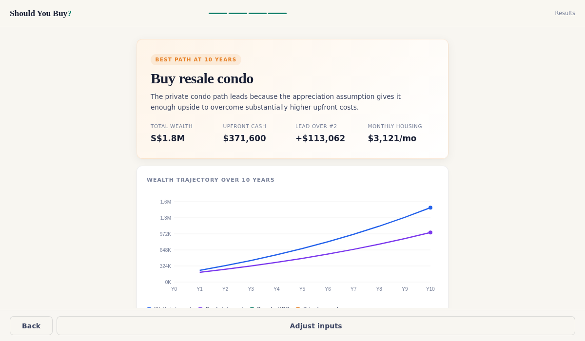

# Should You Buy? — Singapore Property Wealth Projection Tool

What does the math actually say? Property, stocks, bonds, or some combination? This tool projects your wealth across different paths based on historical returns and your actual numbers.

**[Run the numbers](https://l-t-x-o.github.io/should-you-buy-sg/)** | **[Give feedback](https://forms.gle/QDU2FmEUkWHw9nEy6)** | **[Donate to SPCA](https://portal.spca.org.sg/Donation/DonateNow)**

## What it does

Compare staying with parents and investing, renting and investing the difference, buying a resale HDB, or buying a private condo (resale, new launch, or balance unit). Each path is simulated year by year with salary growth, expense inflation, rent escalation, mortgage payments, CPF contributions, property appreciation with lease depreciation, and a blended investment portfolio of your chosen equity/bond split. The tool recommends the best affordable path and flags if an unaffordable option would have projected higher.

## Key features

**Comparison and analysis:** Side-by-side comparison matrix across all paths. Year-by-year wealth trajectory chart (infeasible paths shown as dashed lines). Plain English explanation of results. Sensitivity analysis across return rates and holding periods. Liquid vs non-liquid wealth breakdown. Quick-adjust card on results page for instant recalculation. Share results without exposing personal data, or save a link with full inputs.

**Risk assessment:** Unemployment stress test showing months of survival at zero income after purchase, color-coded by severity. Interest rate sensitivity showing mortgage payments at current rate, +1%, and +2%. SSD early exit penalty table for private condo (years 1-3). Break-even appreciation showing the minimum property growth needed to beat investing. TDSR and MSR regulatory checks.

**Property features:** Paste from PropertyGuru or 99.co listings to auto-populate fields. PSF calculator from price and floor area. New launch premium warning (25-40% above resale). Effective purchase price including bridge rental for new launches. Buy-to-rent scenario with non-owner-occupied property tax rates. CPF housing grants (up to S$80,000 for first-timer couples). Singles-under-35 HDB restriction check. Agent commission transparency note.

**Investment features:** ETF selector with real 10-year returns (VWRA, IWDA, CSPX, ES3, SWRD, VWRD, EIMI). Separate equity and bond return inputs. Configurable equity/bond split. Adjustable investment rate (what % of surplus you actually invest). Auto-calculated emergency reserves and move-in costs.

All defaults set to Singapore medians. Runs entirely on your device. No data sent anywhere. Open source.

## Singapore-specific modeling

BSD using current progressive tiers. ABSD rates for SC, SPR, and foreigners (post-April 2023). SSD for private property sold within 3 years. CPF OA contribution rates by age bracket with S$8,000 salary cap. CPF accrued interest at 2.5%. HDB lease depreciation factors and CPF age-plus-lease eligibility rules. Owner-occupied and non-owner-occupied property tax rates from IRAS progressive schedule. HDB loan (80% LTV, 0% min cash) vs bank loan (75% LTV, 5% min cash). 5-year MOP enforcement for HDB paths. CPF housing grants for eligible buyers.

## Assumptions and limitations

This is a decision-support tool, not financial advice. Property appreciation is modeled as a constant annual rate rather than cyclically. Investment returns assume a constant annual rate. Income tax on rental income is not modeled. CPF SA/MA/RS interactions are not modeled. BTO flats are not modeled due to unpredictable ballot timelines. The tool does not weigh lifestyle, emotional stability, or non-financial factors.

## Built with

Claude, a spreadsheet, and too much bubble tea. By Leonard, a regular Singaporean figuring it out like the rest of us.

## License

MIT
